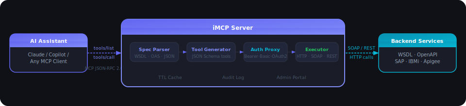
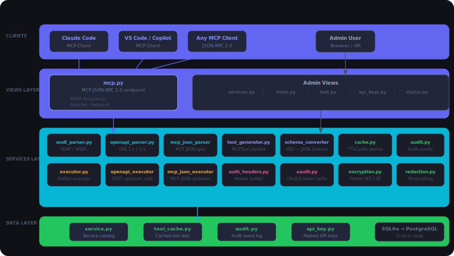
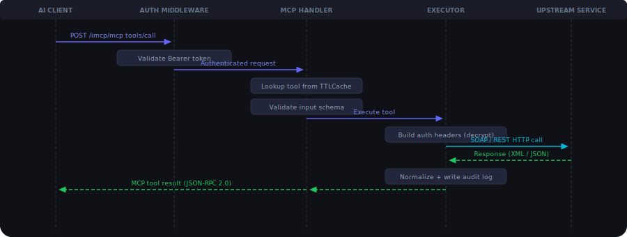

# iMCP — Intelligent Legacy Bridge

> **Turn any existing backend service into an AI-accessible tool — without rewriting a single line of business logic.**

iMCP is an **MCP (Model Context Protocol) server** that acts as a universal bridge between AI assistants and your existing backend services — whether they are legacy SOAP/WSDL systems, modern REST APIs, IBM AS400/IBMi platforms, SAP, Apigee-hosted APIs, mainframe services, or any HTTP-callable endpoint. It dynamically discovers operations from service contracts (WSDL, OpenAPI, or a lightweight MCP JSON spec), generates structured tool definitions, and brokers authenticated calls — turning your existing services into live AI tools in under an hour.

Originally built to modernize insurance systems without rewrites, **iMCP is industry-agnostic**. It works equally well in banking, healthcare, logistics, retail, manufacturing, government, or any domain where valuable business logic is locked inside systems that lack an AI-native interface.

---

## Table of Contents

- [Why iMCP](#why-imcp)
- [Who Is iMCP For](#who-is-imcp-for)
- [How It Works](#how-it-works)
- [Architecture](#architecture)
- [Key Features](#key-features)
- [Tech Stack](#tech-stack)
- [Quick Start](#quick-start)
- [Admin Portal Walkthrough](#admin-portal-walkthrough)
- [Supported Spec Types](#supported-spec-types)
- [MCP JSON Spec Format](#mcp-json-spec-format)
- [Authentication Types](#authentication-types)
- [API Reference](#api-reference)
- [Security Model](#security-model)
- [Configuration](#configuration)
- [Connecting AI Assistants](#connecting-ai-assistants)
- [Project Structure](#project-structure)

---

## Why iMCP

Organizations across every industry run on battle-tested legacy systems — IBMi/AS400, SAP, mainframes, SOAP services, proprietary REST APIs — that hold irreplaceable business logic built up over decades. These systems work, but they are completely invisible to modern AI assistants.

Whether you are in insurance, banking, healthcare, logistics, retail, or government, the challenge is the same: valuable domain knowledge is locked inside systems that cannot be queried conversationally. The traditional path to fixing this means multi-year rewrites costing millions. iMCP offers a different answer:

| Traditional Approach | iMCP Approach |
|---|---|
| 12–18 month full rewrite | Live in < 1 hour per service |
| $2M–$5M+ investment | Minimal integration cost |
| Risk of logic loss and disruption | Zero changes to existing systems |
| Point-in-time integrations | Dynamic discovery — always up to date |
| No AI-native interface | Native MCP tools for any AI assistant |

**Real business impact (targets):**
- 30–40% reduction in support ticket volume (6 months)
- 50% faster developer integration (3 months)
- 60% reduction in time-to-market for new digital initiatives
- > $2M cost savings vs. rewrite in Year 1

---

## Who Is iMCP For

iMCP is built for any organization that has existing backend services — regardless of age, technology, or industry — and wants to make them accessible to AI assistants without a rewrite.

### Industries

| Industry | Typical Use Cases |
|---|---|
| **Insurance** | Policy lookup, claims triage, underwriting checks, customer coverage queries |
| **Banking & Finance** | Account queries, transaction history, loan status, compliance checks |
| **Healthcare** | Patient record lookup, appointment scheduling, eligibility verification |
| **Logistics & Supply Chain** | Shipment tracking, inventory queries, order management |
| **Retail & E-commerce** | Product catalog, stock availability, order status, returns |
| **Manufacturing** | Work order status, production metrics, quality control queries |
| **Government & Public Sector** | Case management, permit status, service request tracking |
| **Telecommunications** | Subscriber management, service provisioning, fault tracking |

### Compatible Backend Systems

iMCP works with any system that exposes a WSDL, OpenAPI spec, or a callable HTTP endpoint:

- **IBM AS400 / IBMi** — SOAP/WSDL services from RPG and COBOL programs
- **SAP** — BAPI/RFC services exposed via SAP Web Services
- **Mainframe** — CICS, IMS transaction services wrapped in WSDL or REST
- **Oracle / PeopleSoft / Siebel** — enterprise service bus and web service layers
- **Modern REST APIs** — any OpenAPI 2.x / 3.x documented service
- **API Gateways** — Apigee, AWS API Gateway, Azure API Management, Kong
- **Internal microservices** — any HTTP service you can describe with MCP JSON
- **On-premise SOAP services** — any WS-* or basic SOAP/HTTP endpoint

---

## How It Works



1. **Register** a service by providing its WSDL URL, OpenAPI spec URL, or uploading an MCP JSON file.
2. **iMCP parses** the spec, extracts operations, and generates JSON Schema-typed MCP tool definitions.
3. **Tools are cached** in the database and served instantly to any connected AI client.
4. **When an AI calls a tool**, iMCP authenticates, validates inputs, calls the upstream service, and returns the normalized result.
5. **Everything is logged** — every tool call produces a structured audit event with correlation ID, actor, latency, and outcome.

---

## Architecture

### Logical Components



```
imcp/
├── views/
│   ├── mcp.py              # MCP JSON-RPC 2.0 endpoint (tools/list, tools/call)
│   └── admin/
│       ├── services.py     # Service catalog CRUD
│       ├── tools.py        # Tool registry + cache refresh
│       ├── test.py         # Test console execution
│       ├── status.py       # System health + metrics
│       ├── api_keys.py     # API key management
│       └── pages.py        # Portal page rendering
├── services/
│   ├── wsdl_parser.py      # WSDL / SOAP spec parsing
│   ├── openapi_parser.py   # OpenAPI 2.x / 3.x spec parsing
│   ├── mcp_json_parser.py  # Custom MCP JSON spec parsing
│   ├── schema_converter.py # XSD → JSON Schema conversion
│   ├── tool_generator.py   # MCPTool dataclass + generation pipeline
│   ├── executor.py         # Unified tool execution (test console path)
│   ├── openapi_executor.py # OpenAPI upstream HTTP calls
│   ├── mcp_json_executor.py# MCP JSON upstream HTTP calls
│   ├── auth_headers.py     # Auth header builder (sync + async)
│   ├── oauth.py            # OAuth2 client_credentials token cache
│   ├── encryption.py       # Fernet credential encryption at rest
│   ├── cache.py            # TTL tool cache service
│   ├── audit.py            # Structured audit event logging
│   ├── redaction.py        # PII / secret redaction in logs
│   └── health_checker.py   # Upstream service reachability probes
└── models/
    ├── service.py          # Service catalog model
    ├── tool_cache.py       # Cached tool definitions model
    └── audit.py            # Audit event model
```

### Dual Execution Paths

A design principle of iMCP is **execution parity**: the Admin Portal's Test Console and the live MCP endpoint both run through the same internal execution handler. What you test in the portal is exactly what an AI assistant will call in production — no surprises.

---

## Key Features

### Spec-Driven Tool Generation
- **WSDL/SOAP**: Parses SOAP services from any platform — IBM AS400/IBMi, SAP, Oracle, mainframe, or any enterprise system that exposes a WSDL. Extracts operations, input/output message types, and converts XSD complex types to JSON Schema with full nested object support.
- **OpenAPI 2.x / 3.x**: Full spec parsing via `prance` with `$ref` resolution. Works with any REST API — cloud, on-premise, or API gateway hosted. Generates one tool per operation with path, query, and request body parameter schemas.
- **MCP JSON**: A lightweight custom format for wrapping any HTTP endpoint directly — no full WSDL or OpenAPI spec required. Ideal for simple REST services, internal microservices, API gateway routes (Apigee, Kong, AWS API Gateway), and quick prototyping.

### Authentication Proxy
iMCP handles all outbound authentication transparently. Four auth types are supported per service:

| Type | How it works |
|---|---|
| **Bearer Token** | Static token injected as `Authorization: Bearer ...` |
| **Basic Auth** | Username + password encoded as `Authorization: Basic ...` |
| **Custom Headers** | Any arbitrary headers (e.g., `X-API-Key`, `X-Tenant`) |
| **OAuth2 Client Credentials** | Fetches a token from a token endpoint using `client_id` / `client_secret`, caches it for ~58 minutes, and refreshes automatically |

All credentials are **Fernet-encrypted at rest** (AES-128-CBC). They are never returned by any API endpoint and are redacted from all logs.

### TTL Caching
- Tool definitions are cached in the database and in a module-level `TTLCache`.
- Cache hits are tracked and displayed on the Status page (hit rate, size, TTL).
- Per-service cache invalidation is available from both the portal and the API.
- OAuth2 tokens are cached separately with a 3,500s TTL (safely under the typical 3,600s token lifetime).

### Admin Portal
A full-featured management UI built with Django + HTMX + Tailwind CSS:

- **Service Catalog** — Add, edit, enable/disable services. Upload spec files directly or provide a URL. Supports per-service operation allowlists and denylists.
- **Tool Registry** — Browse all generated tools by service. Inspect input schemas. Force-refresh individual services.
- **Test Console** — Select any tool, fill in arguments, execute it against the real upstream service, and inspect the raw request/response with secrets redacted.
- **Token Manager** — Create, revoke, and manage API keys for portal and MCP access.
- **Status Page** — Live adapter health, per-service reachability, cache statistics, and recent error log.

### Audit Logging
Every tool call, service change, and authentication event produces a structured audit record containing:
- `correlation_id` — unique per request, included in all upstream calls
- `actor` — API key identity
- `action` — what was done
- `service_id` / `tool_name`
- `status` — success / failure
- `latency_ms`
- `details` — sanitized payload (secrets redacted)

### Operation Allow/Deny Control
Each service supports JSON-based allowlists and denylists:
```json
{ "operations": ["searchPolicy", "getCustomer"] }
```
Operations not in the allowlist (or in the denylist) are invisible to AI clients and cannot be called — even if they exist in the spec.

### MCP JSON Template Download
When adding or editing a service with spec type `MCP JSON`, the portal offers a one-click **Download JSON template** link. The downloaded file contains a fully annotated sample with all required fields, making it easy to define new tools without needing to generate spec files from an AI assistant.

---

## Tech Stack

| Layer | Technology |
|---|---|
| **Web framework** | Django 6.x |
| **WSGI/ASGI server** | Uvicorn |
| **Portal UI** | HTMX + Tailwind CSS (server-rendered) |
| **HTTP client** | httpx (async) |
| **SOAP/WSDL parsing** | zeep + lxml |
| **OpenAPI parsing** | prance + openapi-spec-validator |
| **Caching** | cachetools TTLCache |
| **Encryption** | cryptography (Fernet / AES-128-CBC) |
| **Database** | SQLite (MVP) — drop-in swap to PostgreSQL for production |
| **Auth tokens** | python-jose (JWT) |
| **Testing** | pytest + pytest-asyncio + pytest-cov |

---

## Quick Start

### Prerequisites
- Python 3.11+
- Git

### 1. Clone and set up the environment

```bash
git clone https://github.com/your-org/imcp.git
cd iMCP
python -m venv .venv
# Windows
.venv\Scripts\activate
# macOS / Linux
source .venv/bin/activate

pip install -r requirements.txt
```

### 2. Configure environment variables

Copy the example file and edit it:

```bash
cp .env.example .env
```

`.env` reference (all variables):

```env
# Application
APP_NAME=iMCP
APP_VERSION=0.1.0
DEBUG=True                          # Set to False in production

# Database
DATABASE_URL=sqlite:///./imcp.db    # Swap to postgres://... for production

# Cache
CACHE_TTL_SECONDS=3600              # How long tool definitions are cached
CACHE_MAX_SIZE=1000                 # Max number of cached tool sets

# Rate Limiting
RATE_LIMIT_PER_MINUTE=100

# Authentication
JWT_SECRET=change-me-in-production-use-strong-secret   # Also used for Fernet encryption
JWT_ALGORITHM=HS256
# JWKS_URL=https://your-auth-provider.com/.well-known/jwks.json  # Optional: external JWKS

# CORS
CORS_ORIGINS=["http://localhost:3000","http://localhost:8000"]

# Logging
LOG_LEVEL=INFO                      # DEBUG | INFO | WARNING | ERROR
LOG_FORMAT=json

# Redaction — fields scrubbed from all audit logs
REDACTION_PATTERNS=["password","token","secret","authorization","bearer","ssn","credit_card"]

# Observability (OpenTelemetry)
OTEL_ENABLED=false
# OTEL_ENDPOINT=http://localhost:4318   # Uncomment to enable tracing

# Health Check
HEALTH_CHECK_INTERVAL_MINUTES=5
```

> **Important:** `JWT_SECRET` is also used to derive the Fernet encryption key for stored service credentials. Use a strong random value and keep it consistent across restarts — changing it will invalidate all stored credentials.

### 3. Initialize the database

```bash
python manage.py migrate
```

### 4. Create a superuser (admin account)

```bash
python manage.py createsuperuser
```

You will be prompted for:

```
Username: admin
Email address: admin@example.com
Password: ••••••••
Password (again): ••••••••
Superuser created successfully.
```

> This Django superuser account is used to log in to the Admin Portal at `/admin/login/`. It is separate from iMCP API keys.

### 5. Generate an iMCP API Key

Once logged in to the portal, go to **Token Manager** and create an API key. This key is used to:
- Authenticate calls to the **MCP endpoint** (`/imcp/mcp`) from AI clients (Claude, Copilot, etc.)
- Authenticate calls to the **Admin REST API** (`/imcp/admin/...`)

```
Name:        my-claude-key
Description: Used by Claude Code MCP client
Roles:       admin
```

Copy the full key shown — **it is only displayed once**.

### 6. Start the server

```bash
python manage.py runserver
# or with async/ASGI support
uvicorn config.asgi:application --reload
```

### 7. Open the portal

Navigate to `http://localhost:8000/admin/login/` and log in with the superuser credentials created in step 4.

The portal home is at `http://localhost:8000/imcp/portal/`.

### 8. Connect an AI client

Use the API key from step 5 to connect Claude Code or VS Code:

```bash
# Claude Code CLI
claude mcp add --transport http iMCP http://localhost:8000/imcp/mcp \
  --header "Authorization: Bearer <your-api-key>" \
  --scope project
```

Run `/mcp` inside Claude Code to confirm `iMCP` is listed and tools are available.

---

## Admin Portal Walkthrough

### Adding Your First Service

1. Go to **Services** in the sidebar.
2. Click **+ Add Service**.
3. Fill in:
   - **Name** — a unique identifier (e.g., `Policy Search`)
   - **Spec Type** — `WSDL`, `OpenAPI`, or `MCP JSON`
   - **Spec Source** — provide a URL or upload a file directly
   - **Category** — e.g., `Policy`, `Claims`, `Underwriting`
   - **Auth Type** — select the authentication method and enter credentials
4. Click **Save**. Tools are generated and cached automatically.

### Verifying Generated Tools

1. Go to **Tools** in the sidebar.
2. Select your service from the filter or scroll the list.
3. Each tool shows its name, description, input schema, and cache status.
4. Click **Refresh** on any service to re-parse its spec and regenerate tools.

### Testing a Tool

1. Go to **Test Console** in the sidebar.
2. Select a tool from the dropdown.
3. Fill in the arguments (JSON editor with schema hints).
4. Click **Run**. Results show:
   - Normalized response
   - Raw upstream HTTP request/response (with credentials redacted)
   - Correlation ID and latency

### Monitoring Health

The **Status** page shows:
- Adapter health (up/down)
- Per-service reachability with latency
- Cache size, hit rate, TTL, and miss count
- Recent error log entries

---

## Supported Spec Types

### WSDL (SOAP)
Point iMCP at any WSDL URL or upload a `.wsdl` / `.xml` file. iMCP will:
- Parse all services, ports, and operations
- Extract input message types and convert XSD to JSON Schema
- Handle nested complex types (policies, claims, coverage objects)
- Apply operation allowlists/denylists

### OpenAPI (REST)
Supply an OpenAPI 2.x or 3.x spec as a URL or upload a `.yaml` / `.yml` / `.json` file. iMCP will:
- Resolve all `$ref` references
- Generate one tool per path+method combination
- Map path, query, and request body parameters to the tool `inputSchema`
- Preserve validation constraints (enums, min/max, patterns)

### MCP JSON
A lightweight custom format for wrapping simple REST or Apigee endpoints directly — no full OpenAPI spec required. Upload a `.json` file or provide a URL.

---

## MCP JSON Spec Format

```json
{
  "name": "my-service-name",
  "version": "1.0.0",
  "description": "Brief description of what this service does",
  "tools": [
    {
      "name": "toolName",
      "description": "Describe what this tool does. This text is shown to the AI when selecting tools.",
      "inputSchema": {
        "type": "object",
        "properties": {
          "param1": {
            "type": "string",
            "description": "Description of param1",
            "default": "optional-default-value"
          },
          "param2": {
            "type": "string",
            "description": "Description of param2"
          }
        },
        "required": ["param1"]
      },
      "endpoint": {
        "method": "GET",
        "baseUrl": "https://your-api-base-url.example.com",
        "path": "/your/api/path/",
        "queryParams": ["param1", "param2"]
      }
    }
  ]
}
```

**Field reference:**

| Field | Required | Description |
|---|---|---|
| `name` | Yes | Service identifier |
| `version` | No | Version string |
| `tools[].name` | Yes | Tool name exposed to AI clients |
| `tools[].description` | Yes | Natural-language description for the AI |
| `tools[].inputSchema` | Yes | JSON Schema for tool arguments |
| `tools[].inputSchema.properties[*].default` | No | Default value applied if argument is omitted |
| `tools[].endpoint.method` | Yes | HTTP method: `GET`, `POST`, `PUT`, `DELETE` |
| `tools[].endpoint.baseUrl` | Yes | Base URL of the upstream API |
| `tools[].endpoint.path` | Yes | Path appended to baseUrl |
| `tools[].endpoint.queryParams` | No | List of parameter names sent as query string |

> **Tip:** Click **Download JSON template** in the Add/Edit Service modal (when MCP JSON is selected) to get a pre-filled template file.

---

## Authentication Types

### Bearer Token
```json
{ "token": "your-static-bearer-token" }
```

### Basic Auth
```json
{ "username": "user", "password": "pass" }
```

### Custom Headers
```json
{ "headers": { "X-API-Key": "abc123", "X-Tenant": "acme-corp" } }
```

### OAuth2 Client Credentials
```json
{
  "token_url": "https://auth.example.com/oauth/token",
  "client_id": "your-client-id",
  "client_secret": "your-client-secret",
  "scope": "read:policies"
}
```
iMCP fetches a token from `token_url` using the `client_credentials` grant, caches it for ~58 minutes, and automatically refreshes it — completely transparent to the AI caller.

---

## API Reference

### Request Flow



### MCP Protocol Endpoint

```
POST /imcp/mcp
Content-Type: application/json
Authorization: Bearer <token>
```

**List tools:**
```json
{ "jsonrpc": "2.0", "id": 1, "method": "tools/list", "params": {} }
```

**Call a tool:**
```json
{
  "jsonrpc": "2.0",
  "id": 2,
  "method": "tools/call",
  "params": {
    "name": "searchPolicy",
    "arguments": { "policy-reference": "POL-20241001-001" }
  }
}
```

### REST Convenience Endpoints

| Method | Path | Description |
|---|---|---|
| `GET` | `/imcp/health` | Health check — no auth required |
| `POST` | `/imcp/mcp/tools/list` | List all available tools |
| `POST` | `/imcp/mcp/tools/call` | Execute a tool |

### Admin API

All admin endpoints require `Authorization: Bearer <token>`.

| Method | Path | Description |
|---|---|---|
| `GET` | `/imcp/admin/services` | List services (filter: category, spec_type, enabled) |
| `POST` | `/imcp/admin/services` | Create a service (JSON body or multipart file upload) |
| `GET` | `/imcp/admin/services/<id>` | Get a single service |
| `PUT` | `/imcp/admin/services/<id>` | Update a service (JSON body or multipart file upload) |
| `DELETE` | `/imcp/admin/services/<id>` | Disable (soft) or hard-delete a service |
| `POST` | `/imcp/admin/services/<id>/discover-operations` | Discover operations from the spec |
| `GET` | `/imcp/admin/tools` | List cached tools for a service |
| `POST` | `/imcp/admin/tools/refresh` | Regenerate tools for a service |
| `POST` | `/imcp/admin/test/call` | Execute a tool via the test console |
| `GET` | `/imcp/admin/status` | System status and health metrics |
| `POST` | `/imcp/admin/status/run-checks` | Trigger upstream reachability checks |
| `GET/POST` | `/imcp/admin/api-keys` | List or create API keys |
| `DELETE` | `/imcp/admin/api-keys/<id>` | Revoke an API key |

---

## Security Model

### Credential Storage
Service credentials (tokens, passwords, OAuth2 secrets) are **Fernet-encrypted at rest** using a key derived from Django's `SECRET_KEY` via SHA-256. The encrypted blob is stored in the database. Credentials are:
- Never returned by any GET API response
- Never written to logs (redaction patterns match common secret field names)
- Decrypted only in memory at call time

### Redaction
The audit and logging layer applies configurable redaction patterns to scrub:
- `Authorization` headers
- Fields named `token`, `password`, `client_secret`, `credentials`
- Any field matching the configured PII patterns

### Transport
All upstream service calls use `httpx` with configurable TLS settings. Internal portal and API traffic should be placed behind TLS termination (Nginx / API gateway).

### Operation Governance
Per-service allowlists and denylists enforce which operations can be invoked. Operations outside the allowlist are invisible to AI clients at the `tools/list` level — they cannot be discovered or called.

### API Key Authentication
All portal and MCP endpoints require a bearer token. API keys are stored as hashed values and can be created, listed, and revoked from the Token Manager page.

---

## Configuration

All settings are controlled via `.env` (copy from `.env.example`):

| Variable | Default | Description |
|---|---|---|
| `APP_NAME` | `iMCP` | Application name shown in portal |
| `APP_VERSION` | `0.1.0` | Version string |
| `DEBUG` | `false` | Set to `false` in production |
| `DATABASE_URL` | `sqlite:///./imcp.db` | Database connection string — swap to `postgres://...` for production |
| `CACHE_TTL_SECONDS` | `3600` | How long tool definitions are cached (seconds) |
| `CACHE_MAX_SIZE` | `1000` | Max cached tool sets |
| `RATE_LIMIT_PER_MINUTE` | `100` | Max requests per minute per client |
| `JWT_SECRET` | *(required)* | Secret for JWT signing **and** Fernet credential encryption — keep stable |
| `JWT_ALGORITHM` | `HS256` | JWT signing algorithm |
| `JWKS_URL` | *(optional)* | External JWKS URL for validating tokens from an identity provider |
| `CORS_ORIGINS` | `["http://localhost:8000"]` | Allowed CORS origins (JSON array) |
| `LOG_LEVEL` | `INFO` | `DEBUG` / `INFO` / `WARNING` / `ERROR` |
| `LOG_FORMAT` | `json` | Log output format |
| `REDACTION_PATTERNS` | see `.env.example` | JSON array of field names scrubbed from all audit logs |
| `OTEL_ENABLED` | `false` | Enable OpenTelemetry tracing |
| `OTEL_ENDPOINT` | *(optional)* | OTLP endpoint, e.g. `http://localhost:4318` |
| `HEALTH_CHECK_INTERVAL_MINUTES` | `5` | How often upstream reachability checks run |

### Scaling to Production

| Component | MVP | Production |
|---|---|---|
| Database | SQLite | PostgreSQL |
| Cache | In-memory TTLCache | Redis |
| Deployment | Single process | 2+ replicas behind Nginx |
| Rate limiting | In-memory (slowapi) | Redis-backed |

---

## Connecting AI Assistants

### Claude (Claude Code CLI)

```bash
claude mcp add --transport http iMCP http://localhost:8000/imcp/mcp \
  --header "Authorization: Bearer <your-token>" \
  --scope project
```

This creates a `.mcp.json` in your project directory. Run `/mcp` in Claude Code to confirm `iMCP` is listed and tools are available.

### VS Code (MCP Extension)

Add to `.vscode/mcp.json`:
```json
{
  "servers": {
    "iMCP": {
      "type": "http",
      "url": "http://localhost:8000/imcp/mcp",
      "headers": {
        "Authorization": "Bearer <your-token>"
      }
    }
  }
}
```

### Any MCP-Compatible Client

iMCP implements the **MCP JSON-RPC 2.0 protocol** (`protocol version: 2024-11-05`). Any client that supports `tools/list` and `tools/call` over HTTP will work without modification.

---

## Project Structure

```
iMCP/
├── imcp/                       # Django application
│   ├── models/                 # Service, ToolCacheMetadata, AuditEvent, ApiKey
│   ├── views/
│   │   ├── mcp.py              # MCP JSON-RPC endpoint
│   │   └── admin/              # Portal API views
│   ├── services/               # Core business logic
│   ├── templates/imcp/         # HTMX + Tailwind portal templates
│   ├── migrations/             # Database migrations
│   ├── middleware/             # Correlation ID, auth middleware
│   └── management/commands/   # imcp_health_check management command
├── media/imcp_specs/           # Uploaded spec files (auto-cleaned on service delete)
├── docs/                       # Architecture SVG diagrams (used in README)
│   ├── overview-flow.svg
│   ├── component-architecture.svg
│   └── request-flow.svg
├── iMCP_docs.html              # Full interactive documentation with diagrams
├── .env.example                # Environment variable template
└── README.md
```

---

## Representative Use Cases

**Insurance — Policy inquiry**
> "Show all active policies for customer ID 12345."

The AI selects the `searchPolicy` tool, executes it with the customer ID, and presents the results conversationally.

**Insurance — Claims triage**
> "Show me all pending claims over $10,000 from the last 30 days."

The AI calls the `searchClaim` tool with filters, then reasons over the structured results to surface the most urgent items.

**Banking — Account overview**
> "What is the current balance and recent transaction history for account A-98765?"

iMCP calls the core banking SOAP service, normalizes the XML response, and hands structured data to the AI.

**Healthcare — Eligibility check**
> "Is patient P-00123 eligible for the scheduled procedure under their current plan?"

The AI calls `checkEligibility` through iMCP. The legacy system responds with coverage details; the AI explains them in plain language.

**Logistics — Shipment tracking**
> "Where is order ORD-20240815 and what is the estimated delivery date?"

iMCP calls the logistics REST API using a Bearer token, returns the shipment status, and the AI provides a plain-English update.

**API gateway integration (OAuth2)**
> "Look up the product record for SKU-4892 in the central catalog."

iMCP automatically obtains an OAuth2 token from the configured token endpoint, calls the API gateway-hosted endpoint, and returns the result — the AI caller never handles authentication directly.

---

## License

This project is licensed under the **Business Source License 1.1 (BUSL-1.1)**.

- **Free to use** for non-production, evaluation, development, and internal business operations.
- **Not permitted** to offer as a hosted/managed commercial service or competing product without a commercial license.
- **Converts to Apache 2.0** automatically on **2029-03-16**.

See [LICENSE](LICENSE) for full terms. For commercial licensing enquiries, open an issue on GitHub.
